# Astro CMS & SNS自動投稿ツール 処理・トラフィックフロー図

## 1. システム全体フロー図

### 1.1 全体アーキテクチャフロー

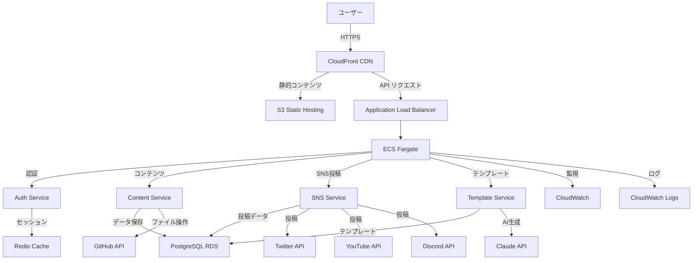
```mermaid
graph TB
    User[ユーザー] --> |HTTPS| CloudFront[CloudFront CDN]
    CloudFront --> |静的コンテンツ| S3[S3 Static Hosting]
    CloudFront --> |API リクエスト| ALB[Application Load Balancer]
    
    ALB --> ECS[ECS Fargate]
    ECS --> |認証| Auth[Auth Service]
    ECS --> |コンテンツ| Content[Content Service]
    ECS --> |SNS投稿| SNS[SNS Service]
    ECS --> |テンプレート| Template[Template Service]
    
    Auth --> |セッション| Redis[Redis Cache]
    Content --> |データ保存| RDS[PostgreSQL RDS]
    SNS --> |投稿データ| RDS
    Template --> |テンプレート| RDS
    
    Content --> |ファイル操作| GitHub[GitHub API]
    SNS --> |投稿| TwitterAPI[Twitter API]
    SNS --> |投稿| YouTubeAPI[YouTube API]
    SNS --> |投稿| DiscordAPI[Discord API]
    
    Template --> |AI生成| ClaudeAPI[Claude API]
    
    ECS --> |監視| CloudWatch[CloudWatch]
    ECS --> |ログ| CloudWatchLogs[CloudWatch Logs]
```

### 1.2 ユーザーアクションフロー

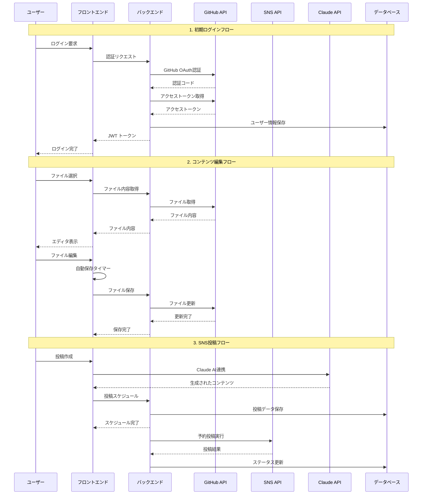
```mermaid
sequenceDiagram
    participant U as ユーザー
    participant F as フロントエンド
    participant B as バックエンド
    participant G as GitHub API
    participant S as SNS API
    participant C as Claude API
    participant D as データベース
    
    Note over U,D: 1. 初期ログインフロー
    U->>F: ログイン要求
    F->>B: 認証リクエスト
    B->>G: GitHub OAuth認証
    G-->>B: 認証コード
    B->>G: アクセストークン取得
    G-->>B: アクセストークン
    B->>D: ユーザー情報保存
    B-->>F: JWT トークン
    F-->>U: ログイン完了
    
    Note over U,D: 2. コンテンツ編集フロー
    U->>F: ファイル選択
    F->>B: ファイル内容取得
    B->>G: ファイル取得
    G-->>B: ファイル内容
    B-->>F: ファイル内容
    F-->>U: エディタ表示
    
    U->>F: ファイル編集
    F->>F: 自動保存タイマー
    F->>B: ファイル保存
    B->>G: ファイル更新
    G-->>B: 更新完了
    B-->>F: 保存完了
    
    Note over U,D: 3. SNS投稿フロー
    U->>F: 投稿作成
    F->>C: Claude AI連携
    C-->>F: 生成されたコンテンツ
    F->>B: 投稿スケジュール
    B->>D: 投稿データ保存
    B-->>F: スケジュール完了
    
    B->>S: 予約投稿実行
    S-->>B: 投稿結果
    B->>D: ステータス更新
```

## 2. コンポーネント間データフロー

### 2.1 フロントエンドデータフロー

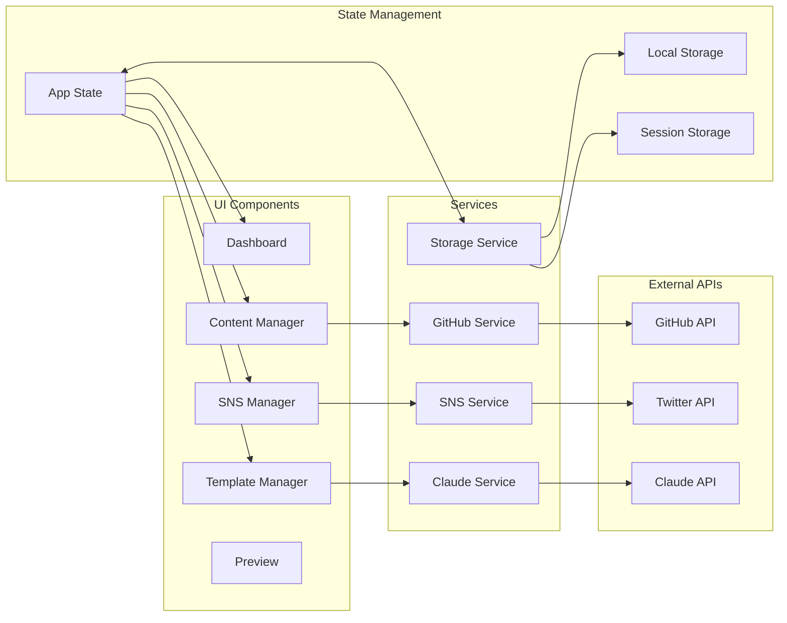
```mermaid
graph LR
    subgraph "State Management"
        AppState[App State]
        LocalStorage[Local Storage]
        SessionStorage[Session Storage]
    end
    
    subgraph "UI Components"
        Dashboard[Dashboard]
        ContentManager[Content Manager]
        TemplateManager[Template Manager]
        SNSManager[SNS Manager]
        Preview[Preview]
    end
    
    subgraph "Services"
        GitHubService[GitHub Service]
        SNSService[SNS Service]
        ClaudeService[Claude Service]
        StorageService[Storage Service]
    end
    
    subgraph "External APIs"
        GitHubAPI[GitHub API]
        TwitterAPI[Twitter API]
        ClaudeAPI[Claude API]
    end
    
    AppState --> Dashboard
    AppState --> ContentManager
    AppState --> TemplateManager
    AppState --> SNSManager
    
    ContentManager --> GitHubService
    SNSManager --> SNSService
    TemplateManager --> ClaudeService
    
    GitHubService --> GitHubAPI
    SNSService --> TwitterAPI
    ClaudeService --> ClaudeAPI
    
    StorageService --> LocalStorage
    StorageService --> SessionStorage
    
    AppState <--> StorageService
```

### 2.2 バックエンドデータフロー

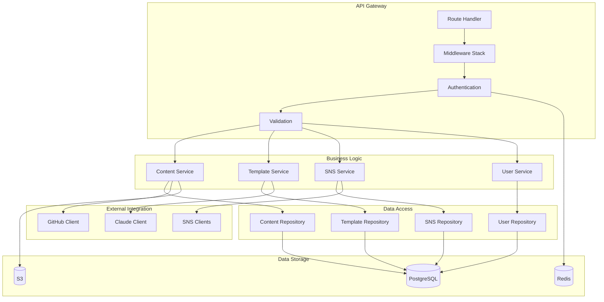
```mermaid
graph TB
    subgraph "API Gateway"
        Route[Route Handler]
        Middleware[Middleware Stack]
        Auth[Authentication]
        Validation[Validation]
    end
    
    subgraph "Business Logic"
        ContentService[Content Service]
        TemplateService[Template Service]
        SNSService[SNS Service]
        UserService[User Service]
    end
    
    subgraph "Data Access"
        ContentRepo[Content Repository]
        TemplateRepo[Template Repository]
        UserRepo[User Repository]
        SNSRepo[SNS Repository]
    end
    
    subgraph "External Integration"
        GitHubClient[GitHub Client]
        SNSClients[SNS Clients]
        ClaudeClient[Claude Client]
    end
    
    subgraph "Data Storage"
        PostgreSQL[(PostgreSQL)]
        Redis[(Redis)]
        S3[(S3)]
    end
    
    Route --> Middleware
    Middleware --> Auth
    Auth --> Validation
    Validation --> ContentService
    Validation --> TemplateService
    Validation --> SNSService
    Validation --> UserService
    
    ContentService --> ContentRepo
    TemplateService --> TemplateRepo
    SNSService --> SNSRepo
    UserService --> UserRepo
    
    ContentService --> GitHubClient
    SNSService --> SNSClients
    TemplateService --> ClaudeClient
    
    ContentRepo --> PostgreSQL
    TemplateRepo --> PostgreSQL
    SNSRepo --> PostgreSQL
    UserRepo --> PostgreSQL
    
    Auth --> Redis
    ContentService --> S3
```

## 3. 主要機能別処理フロー

### 3.1 ファイル編集フロー

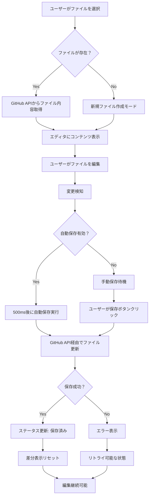
```mermaid
flowchart TD
    A[ユーザーがファイルを選択] --> B{ファイルが存在？}
    B -->|Yes| C[GitHub APIからファイル内容取得]
    B -->|No| D[新規ファイル作成モード]
    
    C --> E[エディタにコンテンツ表示]
    D --> E
    
    E --> F[ユーザーがファイルを編集]
    F --> G[変更検知]
    G --> H{自動保存有効？}
    
    H -->|Yes| I[500ms後に自動保存実行]
    H -->|No| J[手動保存待機]
    
    I --> K[GitHub API経由でファイル更新]
    J --> L[ユーザーが保存ボタンクリック]
    L --> K
    
    K --> M{保存成功？}
    M -->|Yes| N[ステータス更新: 保存済み]
    M -->|No| O[エラー表示]
    
    N --> P[差分表示リセット]
    O --> Q[リトライ可能な状態]
    
    P --> R[編集継続可能]
    Q --> R
```

### 3.2 テンプレート適用フロー

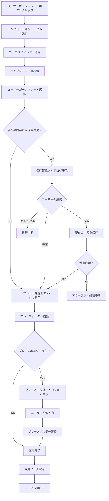
```mermaid
flowchart TD
    A[ユーザーがテンプレートボタンクリック] --> B[テンプレート選択モーダル表示]
    B --> C[カテゴリフィルター適用]
    C --> D[テンプレート一覧表示]
    
    D --> E[ユーザーがテンプレート選択]
    E --> F{現在の内容に未保存変更？}
    
    F -->|Yes| G[保存確認ダイアログ表示]
    F -->|No| H[テンプレート内容をエディタに適用]
    
    G --> I{ユーザーの選択}
    I -->|保存| J[現在の内容を保存]
    I -->|破棄| H
    I -->|キャンセル| K[処理中断]
    
    J --> L{保存成功？}
    L -->|Yes| H
    L -->|No| M[エラー表示・処理中断]
    
    H --> N[プレースホルダー検出]
    N --> O{プレースホルダー存在？}
    
    O -->|Yes| P[プレースホルダー入力フォーム表示]
    O -->|No| Q[適用完了]
    
    P --> R[ユーザーが値入力]
    R --> S[プレースホルダー置換]
    S --> Q
    
    Q --> T[変更フラグ設定]
    T --> U[モーダル閉じる]
```

### 3.3 SNS投稿スケジュールフロー

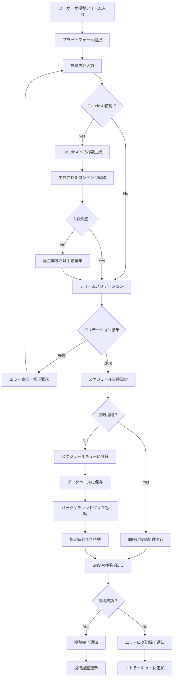
```mermaid
flowchart TD
    A[ユーザーが投稿フォーム入力] --> B[プラットフォーム選択]
    B --> C[投稿内容入力]
    C --> D{Claude AI使用？}
    
    D -->|Yes| E[Claude APIで内容生成]
    D -->|No| F[フォームバリデーション]
    
    E --> G[生成されたコンテンツ確認]
    G --> H{内容承認？}
    H -->|Yes| F
    H -->|No| I[再生成または手動編集]
    I --> F
    
    F --> J{バリデーション結果}
    J -->|失敗| K[エラー表示・修正要求]
    J -->|成功| L[スケジュール日時設定]
    
    K --> C
    L --> M{即時投稿？}
    
    M -->|Yes| N[即座に投稿処理実行]
    M -->|No| O[スケジュールキューに登録]
    
    N --> P[SNS API呼び出し]
    O --> Q[データベースに保存]
    
    P --> R{投稿成功？}
    R -->|Yes| S[投稿完了通知]
    R -->|No| T[エラーログ記録・通知]
    
    Q --> U[バックグラウンドジョブ起動]
    U --> V[指定時刻まで待機]
    V --> P
    
    S --> W[投稿履歴更新]
    T --> X[リトライキューに追加]
```

### 3.4 データ永続化フロー

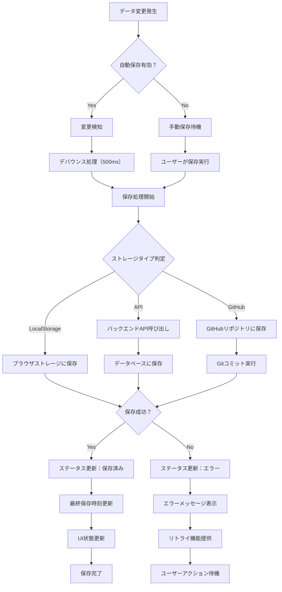
```mermaid
flowchart TD
    A[データ変更発生] --> B{自動保存有効？}
    B -->|Yes| C[変更検知]
    B -->|No| D[手動保存待機]
    
    C --> E[デバウンス処理（500ms）]
    E --> F[保存処理開始]
    D --> G[ユーザーが保存実行]
    G --> F
    
    F --> H{ストレージタイプ判定}
    H -->|LocalStorage| I[ブラウザストレージに保存]
    H -->|API| J[バックエンドAPI呼び出し]
    H -->|GitHub| K[GitHubリポジトリに保存]
    
    I --> L{保存成功？}
    J --> M[データベースに保存]
    K --> N[Gitコミット実行]
    
    M --> L
    N --> L
    
    L -->|Yes| O[ステータス更新：保存済み]
    L -->|No| P[ステータス更新：エラー]
    
    O --> Q[最終保存時刻更新]
    P --> R[エラーメッセージ表示]
    
    Q --> S[UI状態更新]
    R --> T[リトライ機能提供]
    
    S --> U[保存完了]
    T --> V[ユーザーアクション待機]
```

## 4. API通信フロー

### 4.1 GitHub API連携フロー

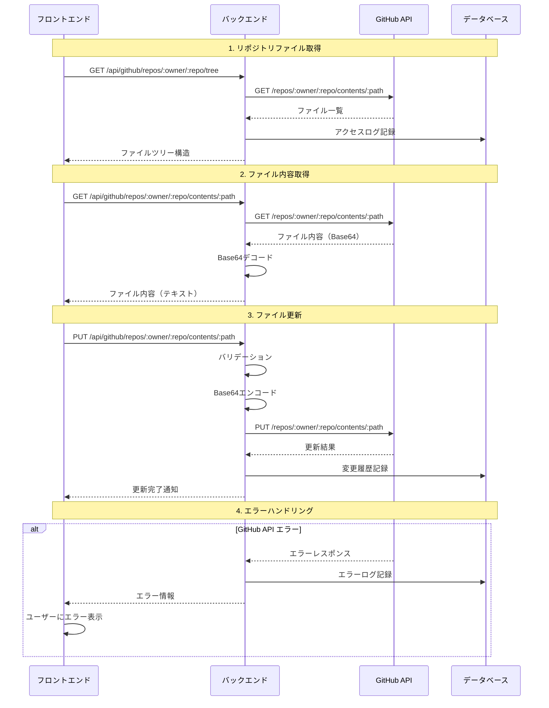
```mermaid
sequenceDiagram
    participant F as フロントエンド
    participant B as バックエンド
    participant G as GitHub API
    participant D as データベース
    
    Note over F,D: 1. リポジトリファイル取得
    F->>B: GET /api/github/repos/:owner/:repo/tree
    B->>G: GET /repos/:owner/:repo/contents/:path
    G-->>B: ファイル一覧
    B->>D: アクセスログ記録
    B-->>F: ファイルツリー構造
    
    Note over F,D: 2. ファイル内容取得
    F->>B: GET /api/github/repos/:owner/:repo/contents/:path
    B->>G: GET /repos/:owner/:repo/contents/:path
    G-->>B: ファイル内容（Base64）
    B->>B: Base64デコード
    B-->>F: ファイル内容（テキスト）
    
    Note over F,D: 3. ファイル更新
    F->>B: PUT /api/github/repos/:owner/:repo/contents/:path
    B->>B: バリデーション
    B->>B: Base64エンコード
    B->>G: PUT /repos/:owner/:repo/contents/:path
    G-->>B: 更新結果
    B->>D: 変更履歴記録
    B-->>F: 更新完了通知
    
    Note over F,D: 4. エラーハンドリング
    alt GitHub API エラー
        G-->>B: エラーレスポンス
        B->>D: エラーログ記録
        B-->>F: エラー情報
        F->>F: ユーザーにエラー表示
    end
```

### 4.2 SNS API連携フロー

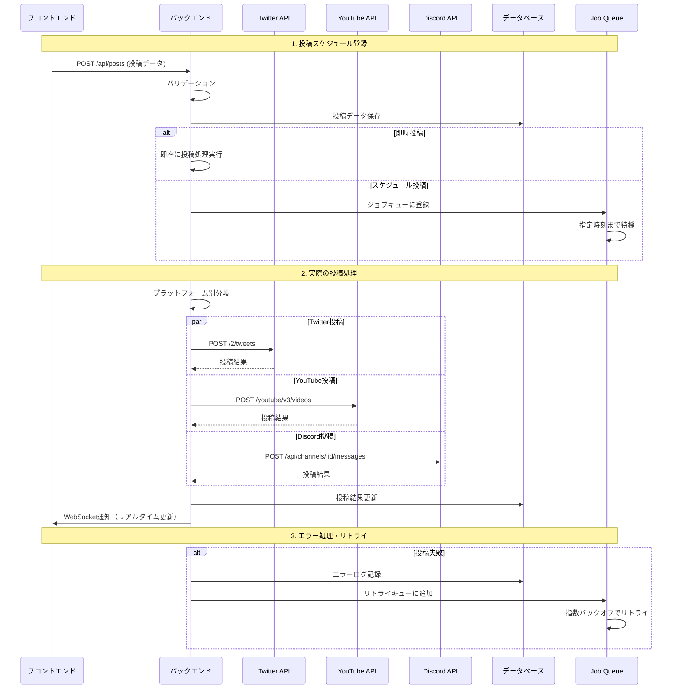
```mermaid
sequenceDiagram
    participant F as フロントエンド
    participant B as バックエンド
    participant T as Twitter API
    participant Y as YouTube API
    participant DC as Discord API
    participant D as データベース
    participant Q as Job Queue
    
    Note over F,Q: 1. 投稿スケジュール登録
    F->>B: POST /api/posts (投稿データ)
    B->>B: バリデーション
    B->>D: 投稿データ保存
    
    alt 即時投稿
        B->>B: 即座に投稿処理実行
    else スケジュール投稿
        B->>Q: ジョブキューに登録
        Q->>Q: 指定時刻まで待機
    end
    
    Note over F,Q: 2. 実際の投稿処理
    B->>B: プラットフォーム別分岐
    
    par Twitter投稿
        B->>T: POST /2/tweets
        T-->>B: 投稿結果
    and YouTube投稿
        B->>Y: POST /youtube/v3/videos
        Y-->>B: 投稿結果
    and Discord投稿
        B->>DC: POST /api/channels/:id/messages
        DC-->>B: 投稿結果
    end
    
    B->>D: 投稿結果更新
    B->>F: WebSocket通知（リアルタイム更新）
    
    Note over F,Q: 3. エラー処理・リトライ
    alt 投稿失敗
        B->>D: エラーログ記録
        B->>Q: リトライキューに追加
        Q->>Q: 指数バックオフでリトライ
    end
```

### 4.3 Claude AI連携フロー

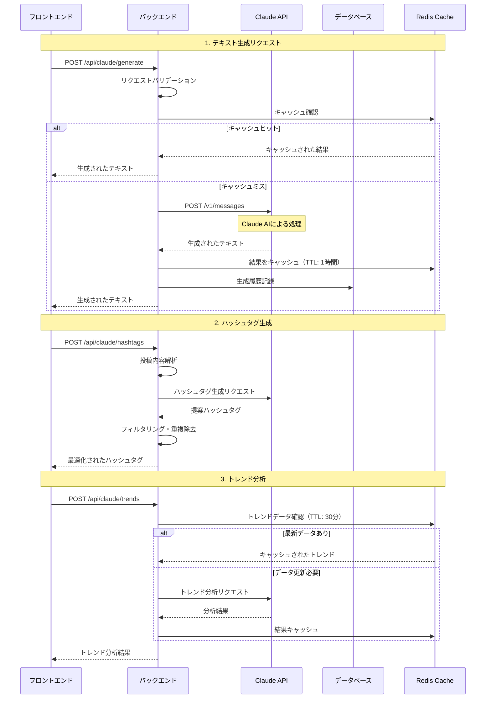
```mermaid
sequenceDiagram
    participant F as フロントエンド
    participant B as バックエンド
    participant C as Claude API
    participant D as データベース
    participant Cache as Redis Cache
    
    Note over F,Cache: 1. テキスト生成リクエスト
    F->>B: POST /api/claude/generate
    B->>B: リクエストバリデーション
    B->>Cache: キャッシュ確認
    
    alt キャッシュヒット
        Cache-->>B: キャッシュされた結果
        B-->>F: 生成されたテキスト
    else キャッシュミス
        B->>C: POST /v1/messages
        Note over C: Claude AIによる処理
        C-->>B: 生成されたテキスト
        B->>Cache: 結果をキャッシュ（TTL: 1時間）
        B->>D: 生成履歴記録
        B-->>F: 生成されたテキスト
    end
    
    Note over F,Cache: 2. ハッシュタグ生成
    F->>B: POST /api/claude/hashtags
    B->>B: 投稿内容解析
    B->>C: ハッシュタグ生成リクエスト
    C-->>B: 提案ハッシュタグ
    B->>B: フィルタリング・重複除去
    B-->>F: 最適化されたハッシュタグ
    
    Note over F,Cache: 3. トレンド分析
    F->>B: POST /api/claude/trends
    B->>Cache: トレンドデータ確認（TTL: 30分）
    
    alt 最新データあり
        Cache-->>B: キャッシュされたトレンド
    else データ更新必要
        B->>C: トレンド分析リクエスト
        C-->>B: 分析結果
        B->>Cache: 結果キャッシュ
    end
    
    B-->>F: トレンド分析結果
```

## 5. エラーハンドリングフロー

### 5.1 統合エラーハンドリングフロー

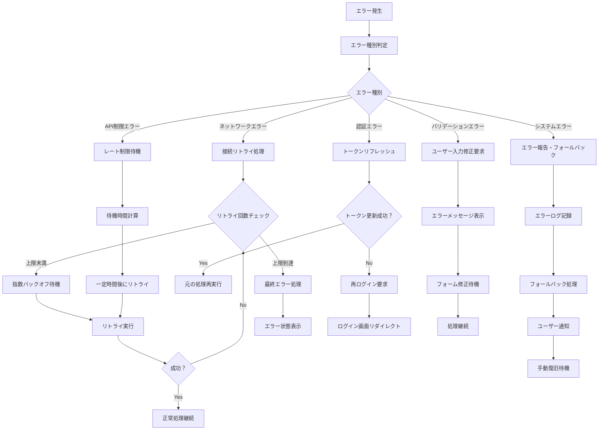
```mermaid
flowchart TD
    A[エラー発生] --> B[エラー種別判定]
    
    B --> C{エラー種別}
    C -->|ネットワークエラー| D[接続リトライ処理]
    C -->|認証エラー| E[トークンリフレッシュ]
    C -->|バリデーションエラー| F[ユーザー入力修正要求]
    C -->|API制限エラー| G[レート制限待機]
    C -->|システムエラー| H[エラー報告・フォールバック]
    
    D --> I{リトライ回数チェック}
    I -->|上限未満| J[指数バックオフ待機]
    I -->|上限到達| K[最終エラー処理]
    
    J --> L[リトライ実行]
    L --> M{成功？}
    M -->|Yes| N[正常処理継続]
    M -->|No| I
    
    E --> O{トークン更新成功？}
    O -->|Yes| P[元の処理再実行]
    O -->|No| Q[再ログイン要求]
    
    F --> R[エラーメッセージ表示]
    R --> S[フォーム修正待機]
    
    G --> T[待機時間計算]
    T --> U[一定時間後にリトライ]
    
    H --> V[エラーログ記録]
    V --> W[フォールバック処理]
    W --> X[ユーザー通知]
    
    K --> Y[エラー状態表示]
    Q --> Z[ログイン画面リダイレクト]
    S --> AA[処理継続]
    U --> L
    X --> BB[手動復旧待機]
```

### 5.2 データ整合性エラーハンドリング

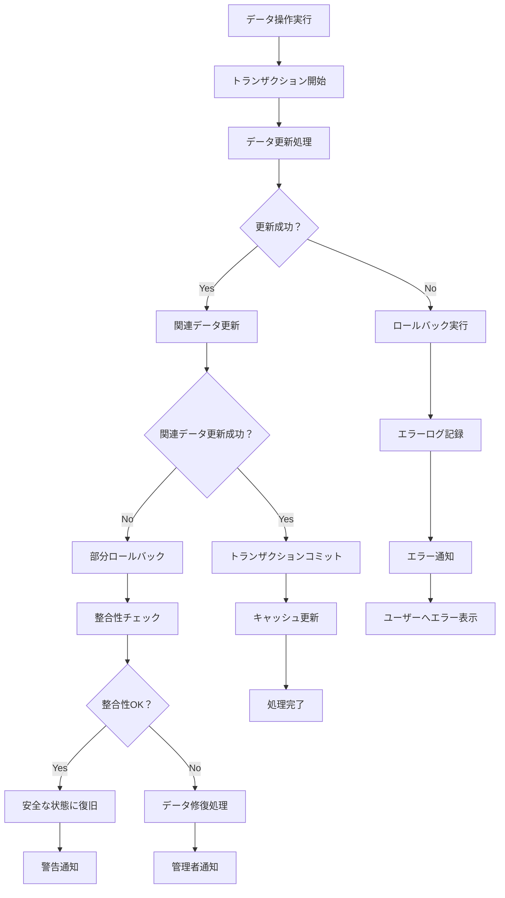
```mermaid
flowchart TD
    A[データ操作実行] --> B[トランザクション開始]
    B --> C[データ更新処理]
    C --> D{更新成功？}
    
    D -->|Yes| E[関連データ更新]
    D -->|No| F[ロールバック実行]
    
    E --> G{関連データ更新成功？}
    G -->|Yes| H[トランザクションコミット]
    G -->|No| I[部分ロールバック]
    
    F --> J[エラーログ記録]
    I --> K[整合性チェック]
    
    H --> L[キャッシュ更新]
    J --> M[エラー通知]
    K --> N{整合性OK？}
    
    N -->|Yes| O[安全な状態に復旧]
    N -->|No| P[データ修復処理]
    
    L --> Q[処理完了]
    M --> R[ユーザーへエラー表示]
    O --> S[警告通知]
    P --> T[管理者通知]
```

## 6. 監視・ログフロー

### 6.1 アプリケーション監視フロー

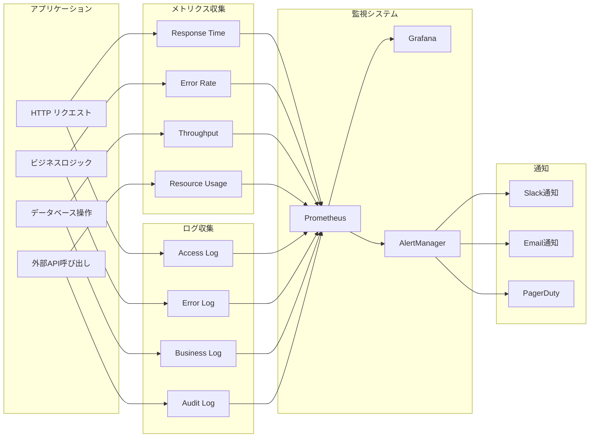
```mermaid
flowchart LR
    subgraph "アプリケーション"
        A[HTTP リクエスト]
        B[ビジネスロジック]
        C[データベース操作]
        D[外部API呼び出し]
    end
    
    subgraph "メトリクス収集"
        E[Response Time]
        F[Error Rate]
        G[Throughput]
        H[Resource Usage]
    end
    
    subgraph "ログ収集"
        I[Access Log]
        J[Error Log]
        K[Business Log]
        L[Audit Log]
    end
    
    subgraph "監視システム"
        M[Prometheus]
        N[Grafana]
        O[AlertManager]
    end
    
    subgraph "通知"
        P[Slack通知]
        Q[Email通知]
        R[PagerDuty]
    end
    
    A --> E
    B --> F
    C --> G
    D --> H
    
    A --> I
    B --> J
    C --> K
    D --> L
    
    E --> M
    F --> M
    G --> M
    H --> M
    
    I --> M
    J --> M
    K --> M
    L --> M
    
    M --> N
    M --> O
    
    O --> P
    O --> Q
    O --> R
```

### 6.2 パフォーマンス監視フロー

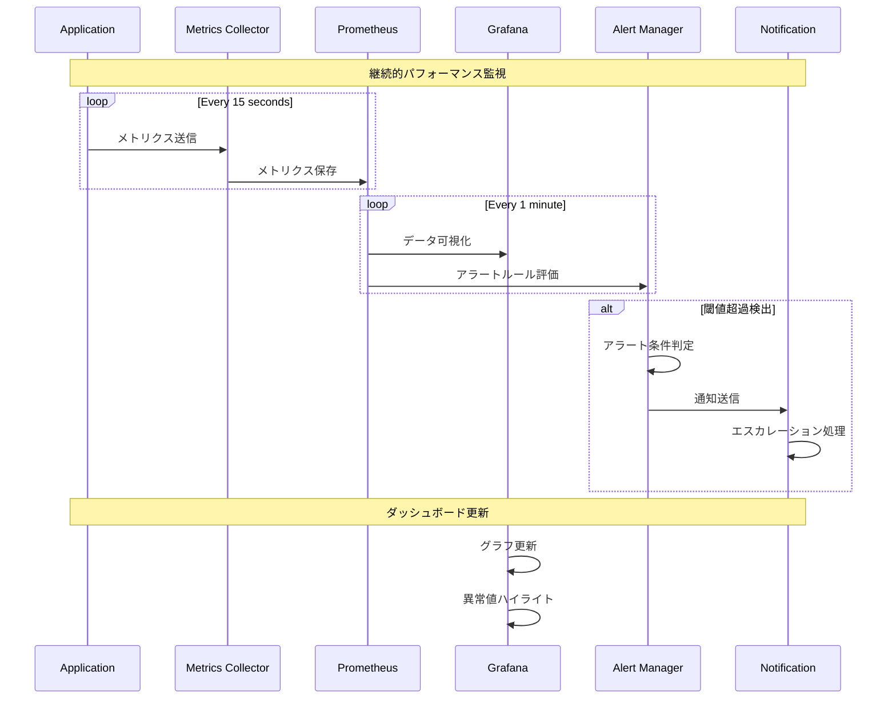
```mermaid
sequenceDiagram
    participant A as Application
    participant M as Metrics Collector
    participant P as Prometheus
    participant G as Grafana
    participant AL as Alert Manager
    participant N as Notification
    
    Note over A,N: 継続的パフォーマンス監視
    
    loop Every 15 seconds
        A->>M: メトリクス送信
        M->>P: メトリクス保存
    end
    
    loop Every 1 minute
        P->>G: データ可視化
        P->>AL: アラートルール評価
    end
    
    alt 閾値超過検出
        AL->>AL: アラート条件判定
        AL->>N: 通知送信
        N->>N: エスカレーション処理
    end
    
    Note over A,N: ダッシュボード更新
    G->>G: グラフ更新
    G->>G: 異常値ハイライト
```

## 7. セキュリティフロー

### 7.1 認証・認可フロー

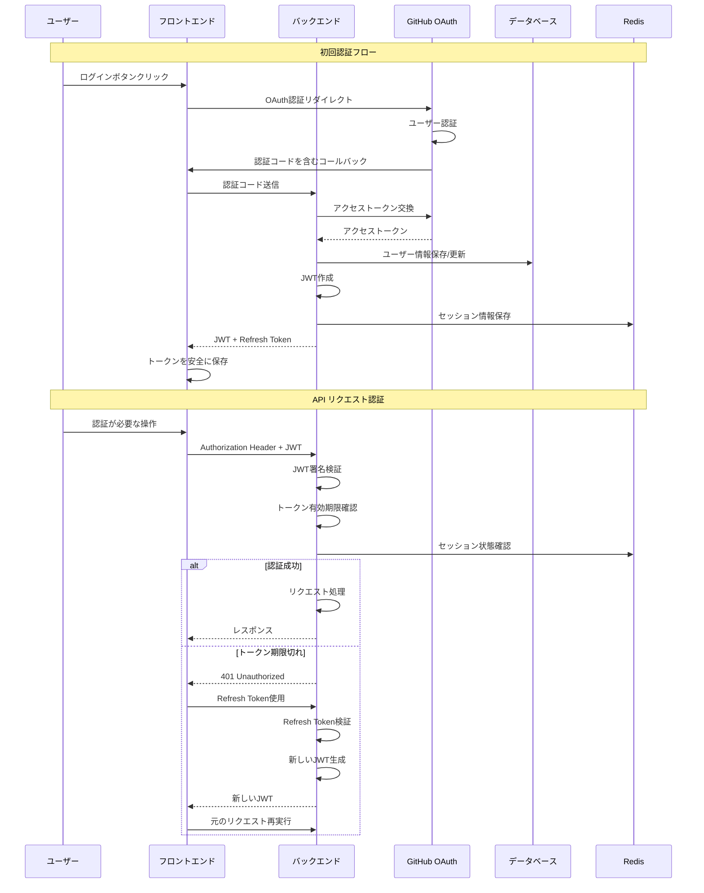
```mermaid
sequenceDiagram
    participant U as ユーザー
    participant F as フロントエンド
    participant B as バックエンド
    participant G as GitHub OAuth
    participant DB as データベース
    participant R as Redis
    
    Note over U,R: 初回認証フロー
    U->>F: ログインボタンクリック
    F->>G: OAuth認証リダイレクト
    G->>G: ユーザー認証
    G->>F: 認証コードを含むコールバック
    F->>B: 認証コード送信
    B->>G: アクセストークン交換
    G-->>B: アクセストークン
    B->>DB: ユーザー情報保存/更新
    B->>B: JWT作成
    B->>R: セッション情報保存
    B-->>F: JWT + Refresh Token
    F->>F: トークンを安全に保存
    
    Note over U,R: API リクエスト認証
    U->>F: 認証が必要な操作
    F->>B: Authorization Header + JWT
    B->>B: JWT署名検証
    B->>B: トークン有効期限確認
    B->>R: セッション状態確認
    
    alt 認証成功
        B->>B: リクエスト処理
        B-->>F: レスポンス
    else トークン期限切れ
        B-->>F: 401 Unauthorized
        F->>B: Refresh Token使用
        B->>B: Refresh Token検証
        B->>B: 新しいJWT生成
        B-->>F: 新しいJWT
        F->>B: 元のリクエスト再実行
    end
```

### 7.2 データ保護フロー

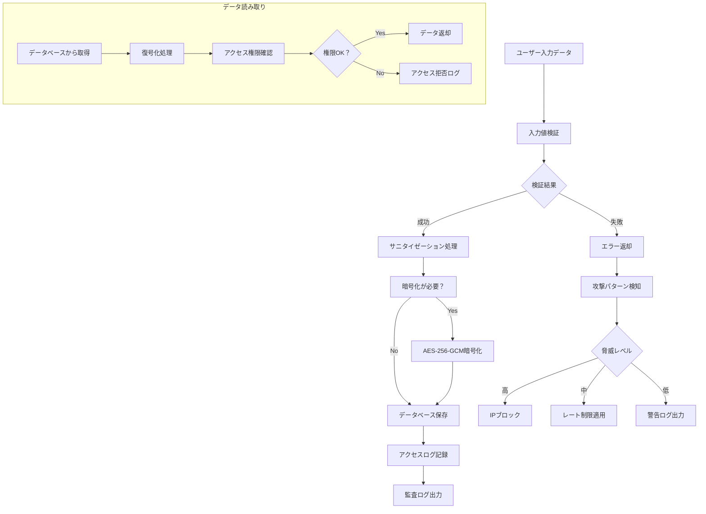
```mermaid
flowchart TD
    A[ユーザー入力データ] --> B[入力値検証]
    B --> C{検証結果}
    C -->|成功| D[サニタイゼーション処理]
    C -->|失敗| E[エラー返却]
    
    D --> F[暗号化が必要？]
    F -->|Yes| G[AES-256-GCM暗号化]
    F -->|No| H[データベース保存]
    
    G --> H
    H --> I[アクセスログ記録]
    I --> J[監査ログ出力]
    
    E --> K[攻撃パターン検知]
    K --> L{脅威レベル}
    L -->|高| M[IPブロック]
    L -->|中| N[レート制限適用]
    L -->|低| O[警告ログ出力]
    
    subgraph "データ読み取り"
        P[データベースから取得] --> Q[復号化処理]
        Q --> R[アクセス権限確認]
        R --> S{権限OK？}
        S -->|Yes| T[データ返却]
        S -->|No| U[アクセス拒否ログ]
    end
```

## 8. デプロイメントフロー

### 8.1 CI/CDパイプライン

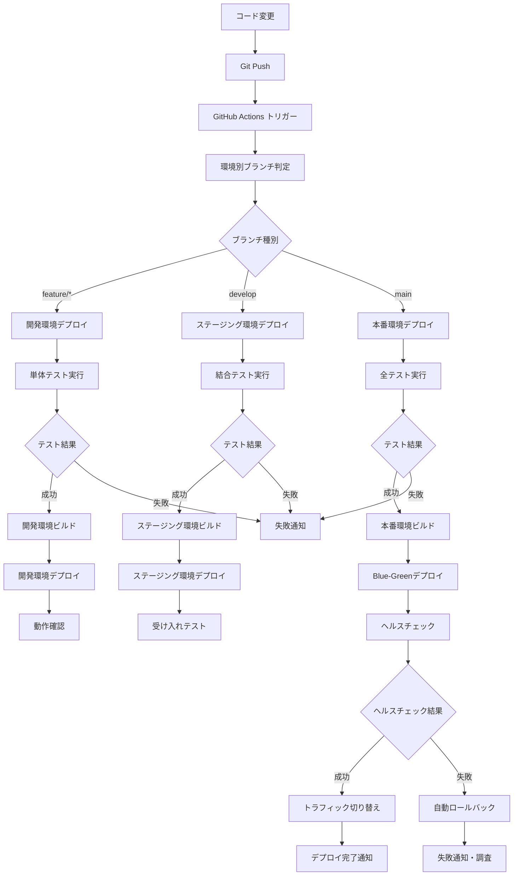
```mermaid
flowchart TD
    A[コード変更] --> B[Git Push]
    B --> C[GitHub Actions トリガー]
    
    C --> D[環境別ブランチ判定]
    D --> E{ブランチ種別}
    
    E -->|feature/*| F[開発環境デプロイ]
    E -->|develop| G[ステージング環境デプロイ]
    E -->|main| H[本番環境デプロイ]
    
    F --> I[単体テスト実行]
    G --> J[結合テスト実行]
    H --> K[全テスト実行]
    
    I --> L{テスト結果}
    J --> M{テスト結果}
    K --> N{テスト結果}
    
    L -->|成功| O[開発環境ビルド]
    M -->|成功| P[ステージング環境ビルド]
    N -->|成功| Q[本番環境ビルド]
    
    L -->|失敗| R[失敗通知]
    M -->|失敗| R
    N -->|失敗| R
    
    O --> S[開発環境デプロイ]
    P --> T[ステージング環境デプロイ]
    Q --> U[Blue-Greenデプロイ]
    
    S --> V[動作確認]
    T --> W[受け入れテスト]
    U --> X[ヘルスチェック]
    
    X --> Y{ヘルスチェック結果}
    Y -->|成功| Z[トラフィック切り替え]
    Y -->|失敗| AA[自動ロールバック]
    
    Z --> BB[デプロイ完了通知]
    AA --> CC[失敗通知・調査]
```

### 8.2 ゼロダウンタイムデプロイフロー

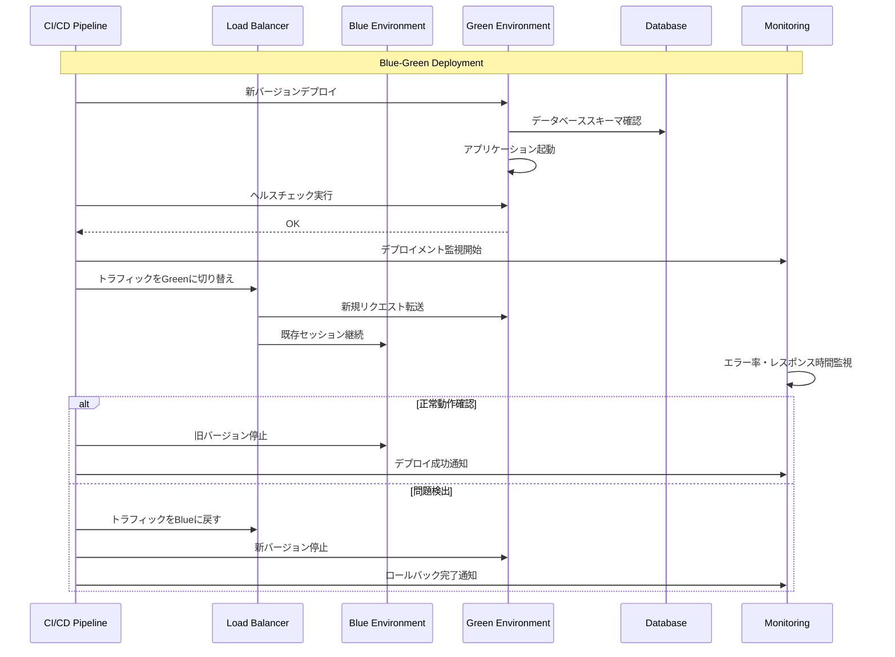
```mermaid
sequenceDiagram
    participant CI as CI/CD Pipeline
    participant LB as Load Balancer
    participant Blue as Blue Environment
    participant Green as Green Environment
    participant DB as Database
    participant M as Monitoring
    
    Note over CI,M: Blue-Green Deployment
    
    CI->>Green: 新バージョンデプロイ
    Green->>DB: データベーススキーマ確認
    Green->>Green: アプリケーション起動
    
    CI->>Green: ヘルスチェック実行
    Green-->>CI: OK
    
    CI->>M: デプロイメント監視開始
    
    CI->>LB: トラフィックをGreenに切り替え
    LB->>Green: 新規リクエスト転送
    LB->>Blue: 既存セッション継続
    
    M->>M: エラー率・レスポンス時間監視
    
    alt 正常動作確認
        CI->>Blue: 旧バージョン停止
        CI->>M: デプロイ成功通知
    else 問題検出
        CI->>LB: トラフィックをBlueに戻す
        CI->>Green: 新バージョン停止
        CI->>M: ロールバック完了通知
    end
```